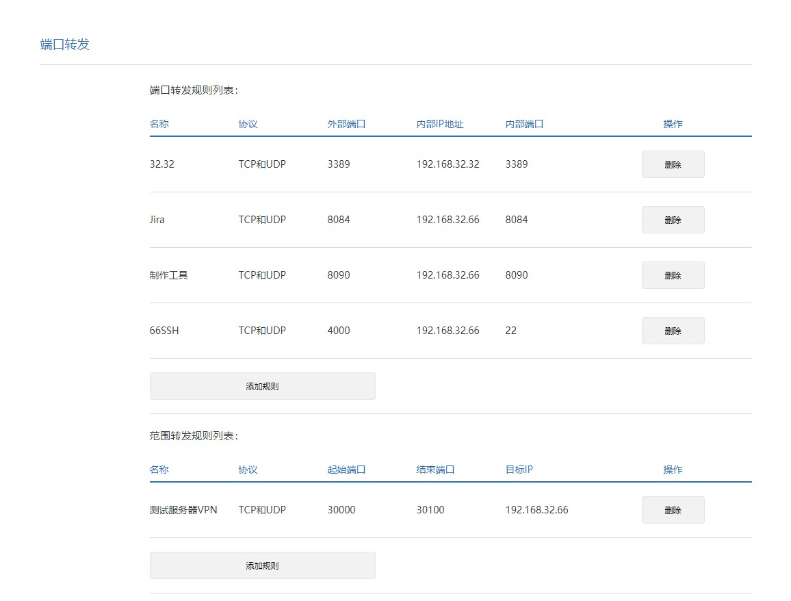

# 部署 shadowSocks

### 1.更新源

    sudo apt-get update

### 2.然后安装 python-pip

    sudo apt-get install python-pip

### 3.安装 SS

    sudo pip install shadowsocks

### 4.配置 SS

    sudo vim /etc/shadowsocks.json

    {
        "server": "0.0.0.0",
        "server_ipv6": "::",
        "local_address": "127.0.0.1",
        "local_port": 1081,
        "port_password": {          #此处添加对应的端口和密码
            "30000":"lvjikeji",  
            "30001":"chukunkun",
            "30002":"wuweijie",
            "30003":"yuanzhen"
        },
        "timeout": 120,
        "udp_timeout": 60,
        "method": "chacha20",
        "protocol": "auth_sha1_v4_compatible",
        "protocol_param": "",
        "obfs": "tls1.2_ticket_auth_compatible",
        "obfs_param": "",
        "dns_ipv6": false,
        "connect_verbose_info": 1,
        "redirect": "",
        "fast_open": false,
        "workers": 1
    }

### 5.重启 ss

    service  shadowsocks restart

# 端口映射

### 1.小米路由器([192.168.32.1](http://192.168.32.1))密码:a12345677

### 2.当前端口映射配置

